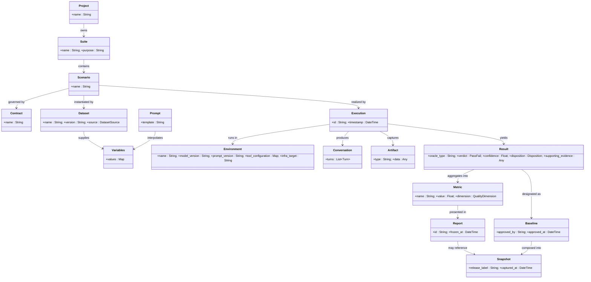
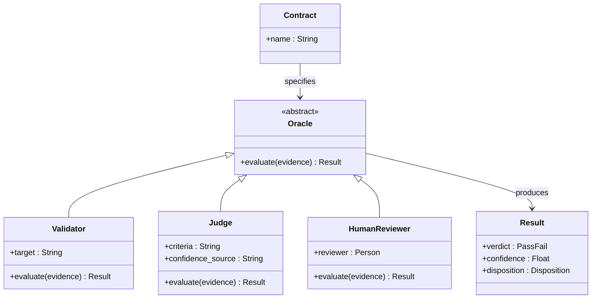
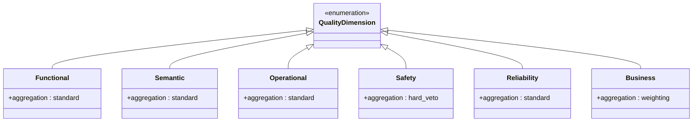
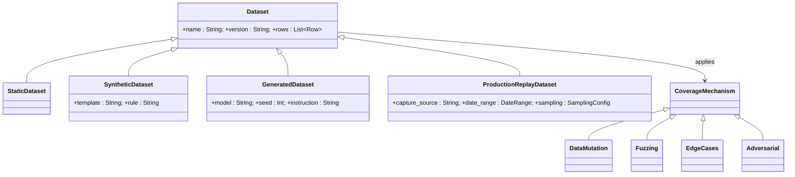
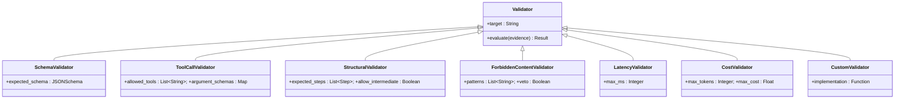
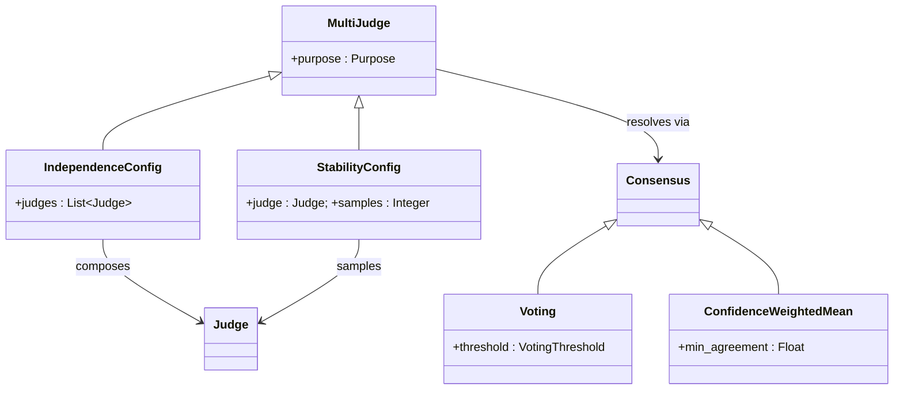
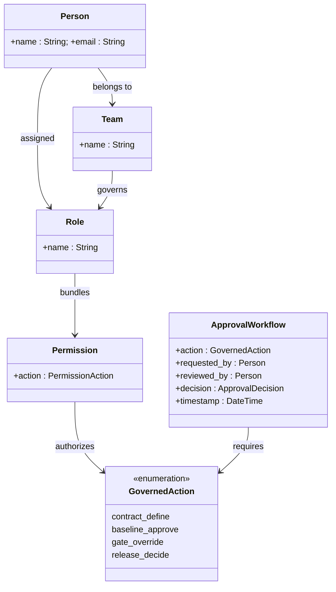

# Appendix E — UML Diagrams

**Status:** confirmed (v0.1).

This appendix provides UML class diagrams visualizing the structural relationships
defined across the specification. Each diagram restates — in visual form — what the
referenced Volumes specify in prose; the Volumes remain authoritative. Diagrams use
Mermaid syntax for inline rendering.

## E.1 — Domain Model: Core Entities

The complete entity graph from Volume II. Arrows read as "owns," "produces," or
"references." `Result`'s fields are abbreviated here for diagram readability — Appendix
C §C.7 is the authoritative shape.

## E.2 — Oracle Hierarchy

The three concrete Oracle types and their relationship to Contracts, Results, and
Confidence (Volume II, Volume V, Volume VI).

*Note: a rendering error in the source draft left this diagram blank in v0.2 — the
cause was an edge label containing a colon, which breaks Mermaid's classDiagram parser.
The offending edge (redundant with the `confidence` attribute already declared on
`Result`, above) has been removed rather than re-escaped.*

## E.3 — Quality Dimensions

The six Quality Dimensions (Volume I, Chapter 2), their primary assessment mechanism,
and their role in the Aggregation Model.

## E.4 — Dataset Taxonomy

Dataset source types and coverage mechanisms (Volume IV).

## E.5 — Validator Engine: Built-in Types

The built-in Validator types and their specialization (Volume V).

## E.6 — Multi-Judge Configuration

Two distinct purposes for running multiple Judges (Volume VI).

## E.7 — Governance Model

Teams, Roles, Permissions, and the Approval Workflow (Volume XII).

