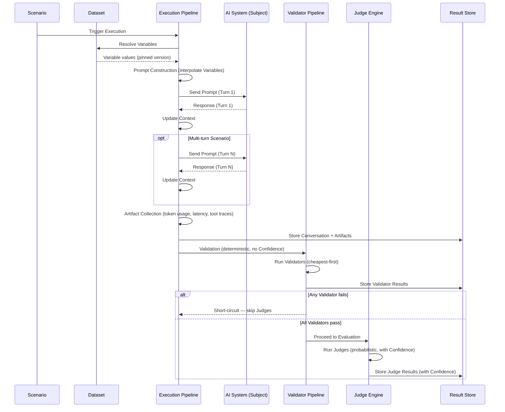
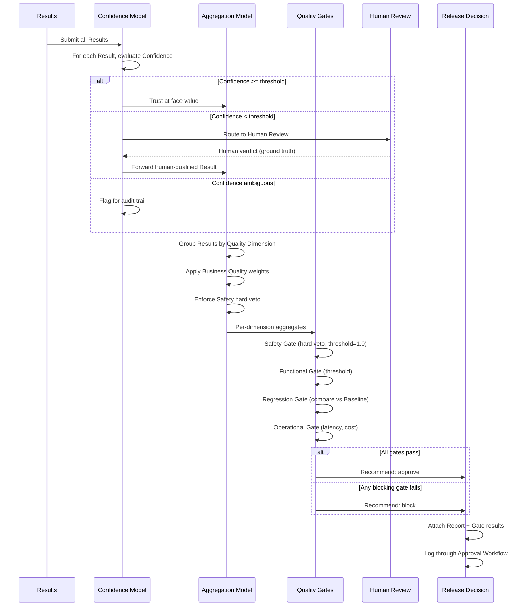
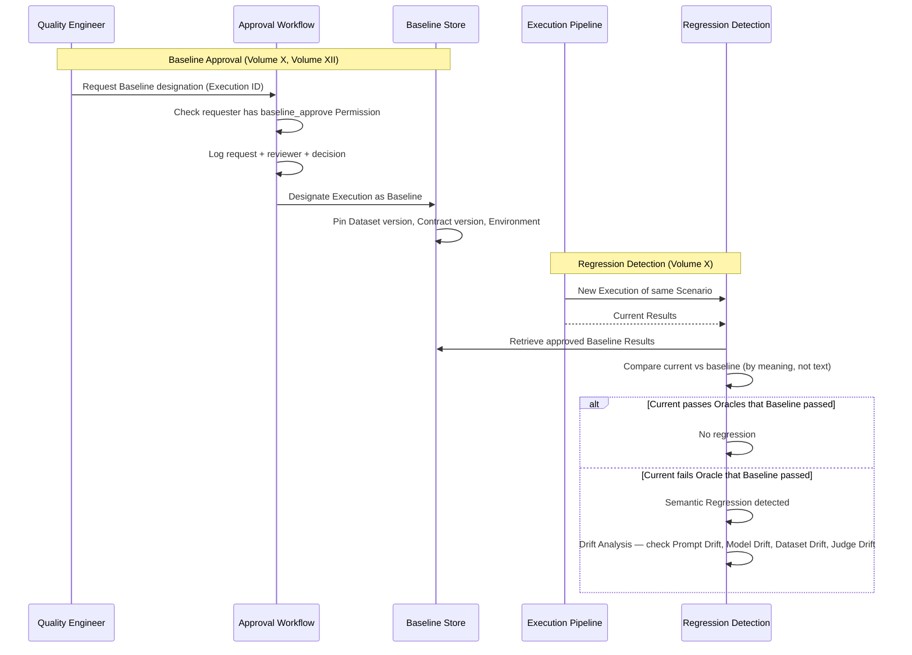
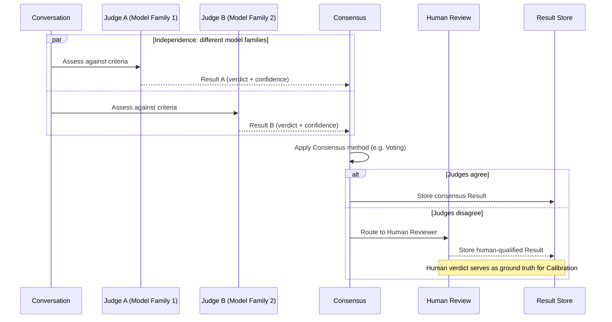
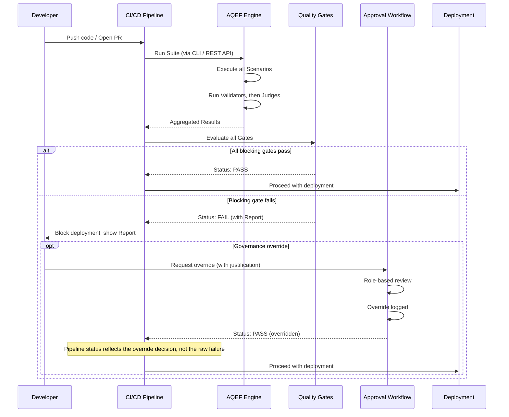
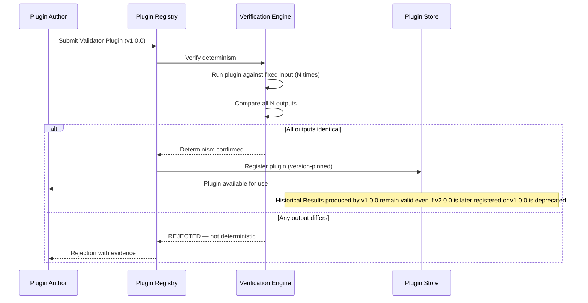

# Appendix F — Sequence Diagrams

**Status:** confirmed (v0.1).

This appendix provides sequence diagrams for the key runtime flows defined in the
specification. Each diagram visualizes — in temporal order — what the referenced
Volumes specify in prose; the Volumes remain authoritative. Diagrams use Mermaid syntax
for inline rendering.

## F.1 — Execution Pipeline

The five-stage pipeline that turns a Scenario into a Conversation, Artifacts, and
Results (Volume III). Note the strict ordering: Validators run before Judges
(Validation before Evaluation, Volume I, Chapter 3).

## F.2 — Decision Pipeline

The sequence from computed Results through the Confidence Model, Aggregation Model,
Quality Gates, to a Release Decision (Volume I, Chapter 6).

## F.3 — Baseline Approval and Regression Detection

Two related flows: designating a Baseline (approval path) and detecting a Semantic
Regression (comparison path). See Volume X and Volume XII.

## F.4 — Multi-Judge Consensus

How a Multi-Judge configuration resolves disagreement into a single verdict (Volume
VI). Shows the independence purpose; stability uses repeated sampling of the same Judge
with the same flow.

## F.5 — CI/CD Integration

How an AQEF Quality Gate result flows through a CI/CD pipeline (Volume XIII).
Platform-agnostic — shows the logical flow, not a specific vendor.

## F.6 — Plugin Registration

The Extension Lifecycle for a Validator Plugin, showing mechanical determinism
verification (Volume XVI).

