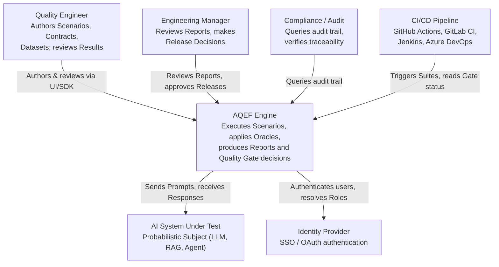
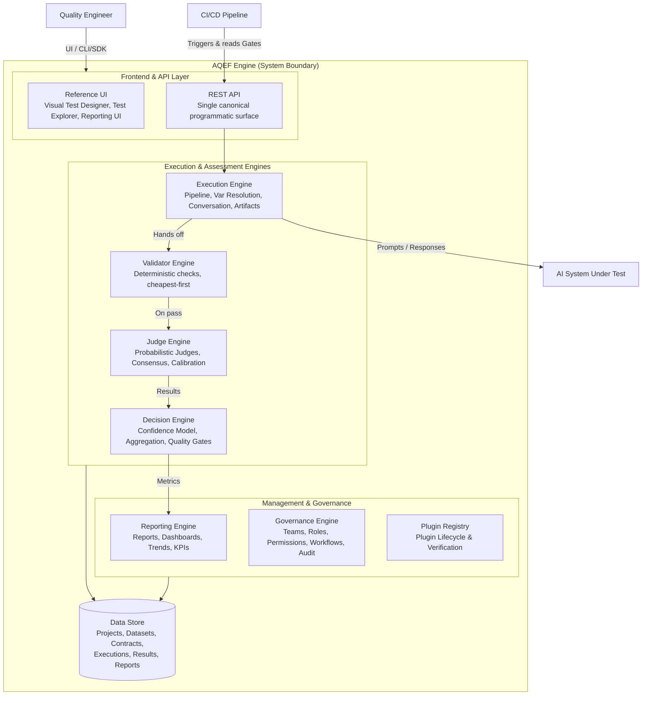
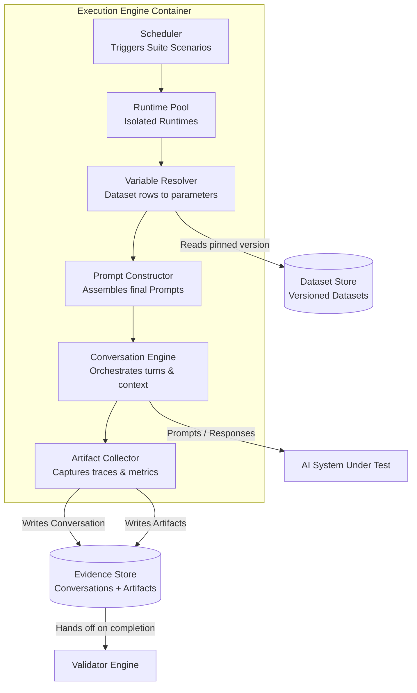
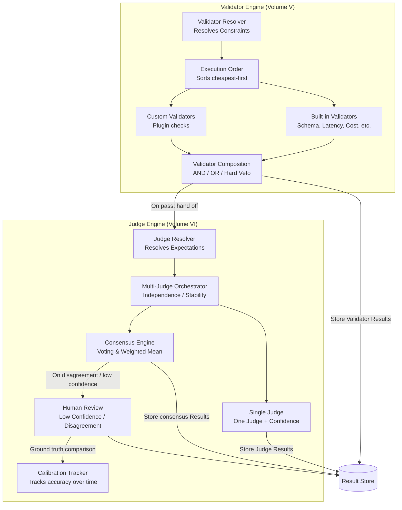
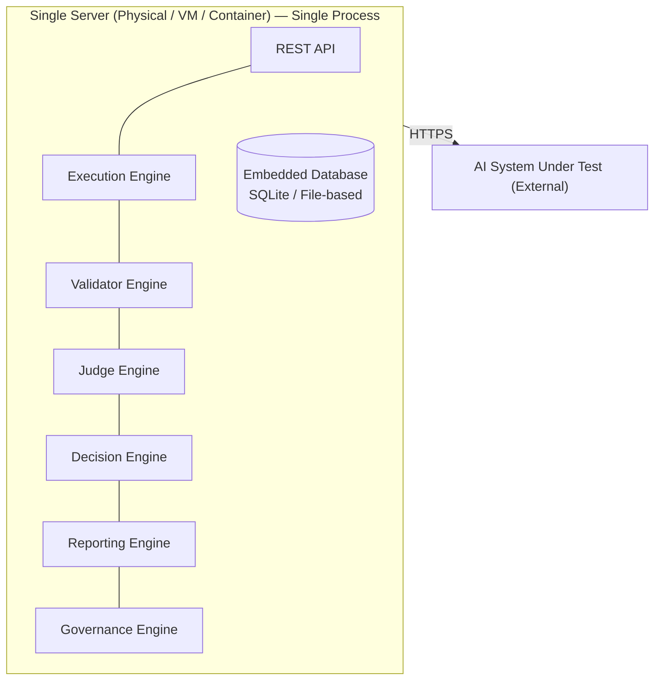
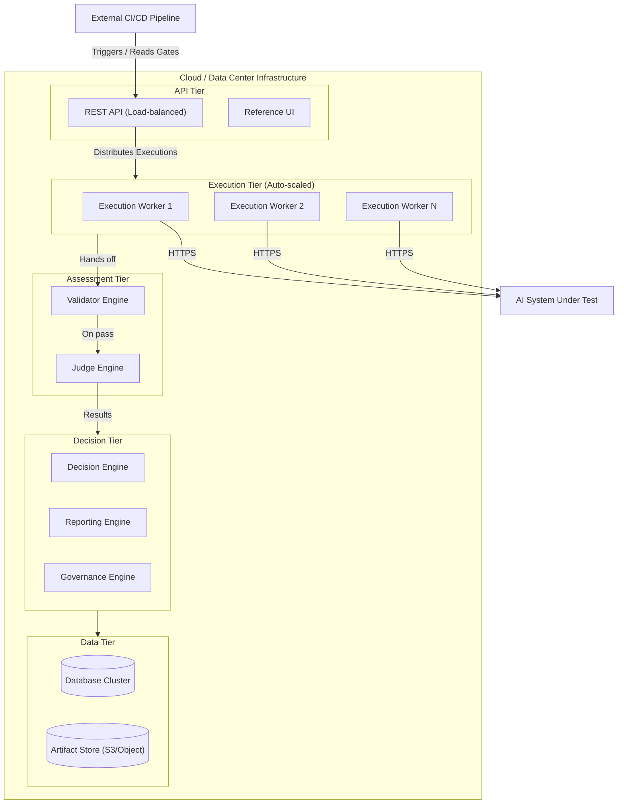

# Appendix G — C4 Model

**Status:** confirmed (v0.1).

This appendix provides C4-style architectural views of an AQEF-conformant system at
four levels of abstraction: Context, Container, Component, and Deployment. The C4 model
(Simon Brown) uses progressively deeper views to show what a system is, what it is made
of, and how it is deployed. Diagrams use Mermaid flowchart syntax with subgraphs for
broad rendering compatibility.

These diagrams visualize the Reference Architecture (Volume I, Chapter 4), the Engine
specifications (Volumes III–VI, XI–XVI), and the Deployment Topologies (Volume XVII).

## G.1 — Level 1: System Context

Who uses an AQEF-conformant system, and what external systems does it interact with?

## G.2 — Level 2: Container Diagram

What are the major runtime containers inside the AQEF Engine? Containers map to the
five logical layers (Volume I, Chapter 4) plus supporting infrastructure.

## G.3 — Level 3: Component Diagram — Execution Engine

Zooming into the Execution Engine container to show its internal components (Volume
III).

## G.4 — Level 3: Component Diagram — Assessment Engines

Zooming into the Validator Engine (Volume V) and Judge Engine (Volume VI) to show their
internal components and the handoff between them.

## G.5 — Deployment: Minimal Engine vs. Enterprise Engine

Two deployment topologies (Volume XVII). Both satisfy the same normative requirements;
they differ in how the logical layers are physically hosted.

**Minimal Engine**

**Enterprise Engine**

## Reading Guide

| If you want to understand... | Start with |
|---|---|
| What AQEF is and who uses it | G.1 (Context) |
| What the major subsystems are | G.2 (Container) |
| How an Execution flows internally | G.3 (Execution components) |
| How Validators and Judges interact | G.4 (Assessment components) |
| How to deploy AQEF | G.5 (Minimal vs Enterprise) |
| What the entity relationships look like | Appendix E (UML) |
| What the temporal flows look like | Appendix F (Sequence) |
