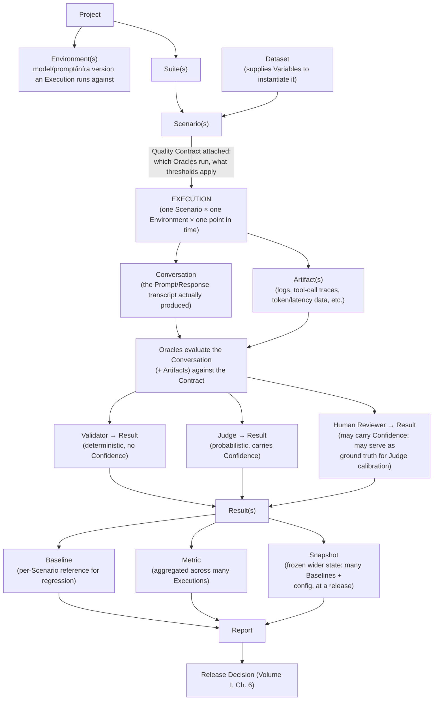

# Volume II — Domain Model

**Status:** confirmed (v0.1).

*Question answered:* What are the building blocks of AQEF?

Conceptual definitions for these same nouns are specified in
Front Matter §8; this volume adds their structural relationships,
precise enough to become the JSON Schema in Appendix B.

## Relationship Overview

Three nouns that are easy to collapse but are kept deliberately separate:
**Scenario** (the static definition of what to test) → **Execution** (the runtime
event of testing it) → **Conversation** (the data that event produced). Definition,
event, and data are different things and stay different entities throughout AQEF.

## Entities

**Project**
Top-level container for a single AI system under quality governance (e.g. "Support Bot
v2"). *Relationships:* owns Environments and Suites; scopes Baselines, Snapshots, Reports.

**Environment**
A named runtime configuration bound to a specific model version, prompt version, tool
configuration, and infra target (e.g. `staging`, `prod-shadow-claude`). *Relationships:*
belongs to a Project; every Execution MUST run inside exactly one Environment.

**Suite**
A named, curated collection of Scenarios grouped by testing purpose (e.g. "Regression
Suite", "Jailbreak Suite"). *Relationships:* belongs to a Project; contains many
Scenarios; is the unit that gets run against an Environment, producing many Executions.

**Scenario** — see Glossary (Front Matter §8). *Relationships:* belongs
to one or more Suites; references a Quality Contract; may reference a Dataset for
data-driven variants; is realized by Executions.

**Conversation** — see Glossary. *Relationships:* produced by exactly one Execution;
composed of ordered Prompts and Responses; evaluated by Oracles to produce Results.

**Prompt**
The atomic unit of stimulus sent to the AI system within a Conversation — a literal
input or a template populated by Variables. *Relationships:* belongs to a Scenario or a
Conversation turn; may draw values from a Dataset via Variables.

**Dataset**
A named, versioned collection of input data — Prompts, Variable sets, or full Scenario
definitions — used to instantiate Scenarios at scale or seed Executions (Static,
Synthetic, Generated, or Production Replay — see Volume IV). *Relationships:* referenced
by Scenarios.

**Variables**
Named parameters, supplied by a Dataset row or fixed on a Scenario, interpolated into
Prompts at Execution time. *Relationships:* consumed by Prompts; sourced from a Dataset
or a Scenario's fixed configuration.

**Contract**
Schema-level name for **Quality Contract** (Glossary) — same entity, two names: "Quality
Contract" in prose and Front Matter, "Contract" in schema and cross-references.
*Relationships:* attached to a Scenario, Suite, or Project; references one or more
Validators and/or Judges and their pass thresholds.

**Validator** — see Glossary. *Relationships:* referenced by one or more Contracts;
consumes a Conversation and/or its Artifacts; produces a Result with no Confidence.

**Judge** — see Glossary. *Relationships:* referenced by one or more Contracts; consumes
a Conversation; produces a Result with Confidence; MAY itself be composed of multiple
underlying judges (Volume VI — Multi Judge, Consensus, Voting).

**Human Reviewer**
The third concrete Oracle, alongside Validator and Judge: a human performing the
assessment, used where automated Judges are not yet trusted for a given criterion,
where policy requires human sign-off (safety-critical Scenarios, Quality Gates), or
where a Result is needed as the ground-truth reference to calibrate or audit Judges
(Volume VI — Calibration, Judge Drift). *Relationships:* referenced by one or more
Contracts, typically alongside a Judge rather than in its place; consumes a Conversation
and its Artifacts; produces a Result that MAY carry a Confidence value; MAY be
designated as the reference against which a Judge's Confidence and Judge Drift are
measured.

**Execution** — see Glossary. *Relationships:* instantiates a Scenario within an
Environment; produces exactly one Conversation and zero or more Artifacts; triggers the
Oracle runs defined by its Scenario's Contract.

**Artifact**
Auxiliary data captured during an Execution beyond the Conversation transcript — logs,
tool-call traces, intermediate agent state, token usage, latency traces, screenshots.
*Relationships:* produced by an Execution; MAY be consumed by Validators or Judges as
evidence beyond the Conversation text.

**Result**
The verdict produced by one Oracle applying one Contract clause to a Conversation (and
its Artifacts) — a pass/fail, Confidence if the Oracle is a Judge or Human Reviewer, a
disposition stating whether that verdict is safe to use yet, and supporting evidence.
*Relationships:* produced by exactly one Oracle for exactly one Execution; many Results
aggregate into a Metric; a Result MAY be designated a Baseline. See Appendix C §C.7 for
the concrete shape.

**Baseline** — see Glossary. *Relationships:* a designated Execution/Result pair for a
given Scenario; referenced by later Executions of that Scenario for Semantic Regression
comparison.

**Snapshot**
A frozen, point-in-time capture of a *wider* state than a single Baseline — e.g. every
Baseline in a Suite, or a Project's full configuration (model/prompt versions,
Contracts) at a release point. *Relationships:* composed of many Baselines and/or
configuration records; used for release-to-release drift comparison (Volume X) — this is
what distinguishes it from a Baseline's per-Scenario reference role.

**Metric**
A quantified, aggregated measure derived from many Results across Executions within a
Suite, Environment, or time range (pass rate, mean Confidence, hallucination rate, cost
per Execution). *Relationships:* computed from Results; feeds Reports, Dashboards,
Quality Gates.

**Report**
A structured, human-facing presentation of Metrics and Results for a Suite, Project, or
time range, supporting a Release Decision or ongoing monitoring. *Relationships:*
composed of Metrics and, optionally, individual Results/Conversations as evidence; the
primary artifact consumed by Governance (Volume XII) and Quality Gates (Volume I, Ch. 6).
