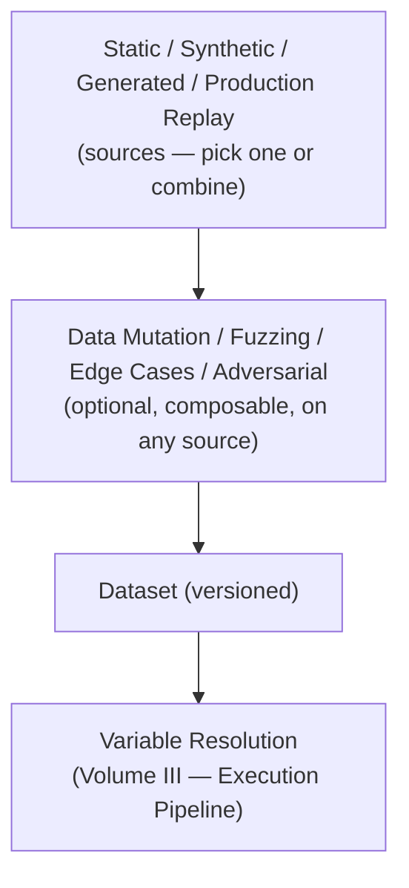

# Volume IV — Dataset Engine

**Status:** confirmed (v0.1).

*Question answered:* How test data is generated and managed.

Chapter 4 named the Dataset Engine as the component that manages Datasets (static,
synthetic, generated, production-replay) and supplies Variables to Scenarios at
Execution time (Volume I), and Volume III's Execution Pipeline names it directly as the
source Variable Resolution draws on. This Volume specifies what a Dataset (Volume II)
actually is in practice: the four ways rows come to exist, the four further mechanisms
that deliberately shape coverage once rows exist, and the one concern — Versioning —
that applies across all of them.

| Mechanism | What produces or changes the rows | Primary purpose |
|---|---|---|
| Static | Authored directly; fixed until edited | Baseline case for narrow, well-understood inputs |
| Synthetic | Mechanical expansion of a template or rule | Scale coverage of a known input space |
| Generated | An AI model produces new rows | Open-ended expansion; watch for correlated blind spots |
| Production Replay | Captured real production Conversations | "Everything is a Test" — real traffic folded back in |
| Data Mutation | Intent-preserving transforms of existing rows | Reliability / generalization under surface variation |
| Fuzzing | Randomized or automated perturbation | Surface unexpected breaking points |
| Edge Cases | Human-identified boundary conditions | Targeted coverage (Volume VIII — Boundary Analysis) |
| Adversarial | Deliberately attack-oriented rows | Feeds Volume IX — Jailbreak, Prompt Injection, Safety |
| Versioning | Cross-cutting — pins every Dataset's content over time | Reproducibility of Variable Resolution (Volume III) |

## Static Datasets

A Static Dataset is a fixed, versioned collection of rows — Prompts, Variable sets, or
full Scenario definitions (Volume II) — authored directly by a person, or otherwise
fixed at a point in time, that does not change except through an explicit edit. It is
the baseline case every other source in this Volume is described relative to: Synthetic
and Generated Datasets programmatically produce what a Static Dataset would otherwise
require hand-authoring row by row, and Production Replay supplies rows from outside
authorship entirely. A Static Dataset's content is exactly what was written, no more and
no less, which makes it the natural home for Scenarios whose acceptable inputs are
narrow and well-understood, where combinatorial expansion or open-ended generation would
add coverage nobody asked for.

## Synthetic Datasets

A Synthetic Dataset expands a small, hand-authored specification — a template, a set of
parameter ranges, a combinatorial rule — into many rows mechanically, without an AI
model in the loop. Where a Static Dataset requires a person to write every row, a
Synthetic Dataset requires a person to write the *rule* that produces many rows; both
are equally deterministic once authored, but a Synthetic Dataset scales coverage of a
known input space — every combination of two parameters, for instance — far beyond what
hand-authoring a Static Dataset would practically allow.

## Generated Datasets

A Generated Dataset uses an AI model to produce new rows — from a seed set, a
specification, or an existing Dataset it is asked to extend — rather than a fixed
mechanical rule. This is where the reasoning behind Independent Oracles (Chapter 3)
surfaces upstream of assessment, not just at it: a generation model drawn from the same
family as the system under test risks producing test cases that systematically avoid
exactly the inputs that model family struggles with, for the same reason a same-family
Judge risks missing exactly the errors that family is prone to. Chapter 3's principle is
a MUST that names Oracles specifically; a Generated Dataset is not an Oracle, so this
Volume extends the same reasoning only as far as a SHOULD.

## Production Replay

A Production Replay Dataset is built from captured production Conversations, folded
back in as Scenarios (Chapter 5; Chapter 3 — Everything is a Test) rather than authored
in advance. This is the one source that arrives continuously rather than at a fixed
point: new production traffic keeps producing new candidate rows, which is why
Versioning (below) matters more here than for any other source — a Production Replay
Dataset's version is ordinarily a snapshot cut at a specific time, not a final, closed
collection the way a Static Dataset is. Captured production data MUST be handled
according to whatever privacy and data-handling policy governs the Project (Governance,
Volume XII); this Volume specifies how such data becomes a Dataset once it is
permissible to use, not the policy that decides whether it is.

## Data Mutation

Data Mutation takes existing rows — from any source above — and applies controlled,
intent-preserving transformations to produce variants: paraphrasing, reordering, format
changes, or other alterations a person would judge to preserve the row's original
meaning. Its purpose is Reliability and generalization: does the system's behavior stay
acceptable under legitimate surface variation it was not literally tested on before?
Data Mutation is deliberately distinct from Fuzzing, even though both operate on
existing rows: Data Mutation's transforms are intent-preserving by design; Fuzzing's are
not.

## Fuzzing

Fuzzing generates or mutates inputs specifically to surface unexpected behavior or
breaking points, typically through randomized or automated perturbation rather than a
person enumerating specific cases — the same concept Chapter 1 named for classical
software testing ("fuzz testing searches for inputs that violate such an invariant"),
operationalized here as a Dataset mechanism for AI systems. Unlike Data Mutation,
Fuzzing's output is not expected to preserve a row's original intent; a Fuzzed row
succeeds at its purpose precisely when it produces behavior a person would not have
thought to test for directly.

## Edge Cases

An Edge Cases Dataset deliberately covers boundary conditions of the input space that a
person has identified in advance — empty or maximal-length inputs, boundary values,
unusual but valid combinations, rare language or formatting. This differs from Fuzzing
the same way Data Mutation differs from it: Edge Cases are targeted and human-named,
chosen because someone can say why that boundary matters, while Fuzzing's coverage is
comparatively undirected and MAY surface boundaries nobody thought to name. An Edge
Cases Dataset is the concrete data a Boundary Analysis test-design technique (Volume
VIII) draws on; this Volume specifies where that data comes from, Volume VIII specifies
how it gets used to design a Scenario.

## Adversarial Datasets

An Adversarial Dataset is deliberately constructed to defeat the system's Safety or
Functional boundaries on purpose — jailbreak attempts, prompt injection payloads,
disallowed-content elicitation — feeding directly into Volume IX's Jailbreak, Prompt
Injection, and Safety test types. The correlated-blind-spot risk named under Generated
Datasets applies here with higher stakes: an Adversarial Dataset generated by a
same-family model risks missing exactly the attack patterns that model family is itself
vulnerable to, which is precisely the population of attacks a Safety Contract most needs
covered. Adversarial Datasets SHOULD draw on an independent source — a different model
family, human red-teaming, or known attack corpora — for the same reason Chapter 3
requires Independent Oracles at assessment time.

## Versioning

Every Dataset, regardless of source, MUST be versioned: a specific Execution's Variable
Resolution (Volume III) is only reproducible if the Dataset row it drew from is pinned
to a specific version, not silently mutable underneath it. This is what lets a Baseline
(Volume II) mean anything at all — a Baseline is only a meaningful reference if the
Dataset that produced its Execution can be identified precisely, not just the Scenario
definition around it. Dataset Versioning is not the same mechanism as a Snapshot (Volume
II): a Snapshot freezes a wider per-release state — many Baselines
plus configuration — at a release point, managed by Reporting & Analytics (Volume XI); a
Dataset's version history is a narrower, ongoing record of that one Dataset's own
content changing over time, managed here. A Snapshot's configuration component MAY
reference which Dataset version was in effect at a given release, but the version
history itself lives in the Dataset Engine.

---

None of these nine mechanisms requires its own Oracle, Contract, or Domain Model entity
— a Dataset produced by any combination of them is still just a Dataset (Volume II),
feeding Variable Resolution the same way regardless of how its rows came to exist. What
differs is coverage: which part of the input space a given Scenario actually exercises,
and how confidently a Result drawn from it can be trusted to generalize. Volume V
(Validator Engine) and Volume VI (Judge Engine) take over from here, assessing what
Volume III's Execution Pipeline produces from the Variables this Volume supplies.
