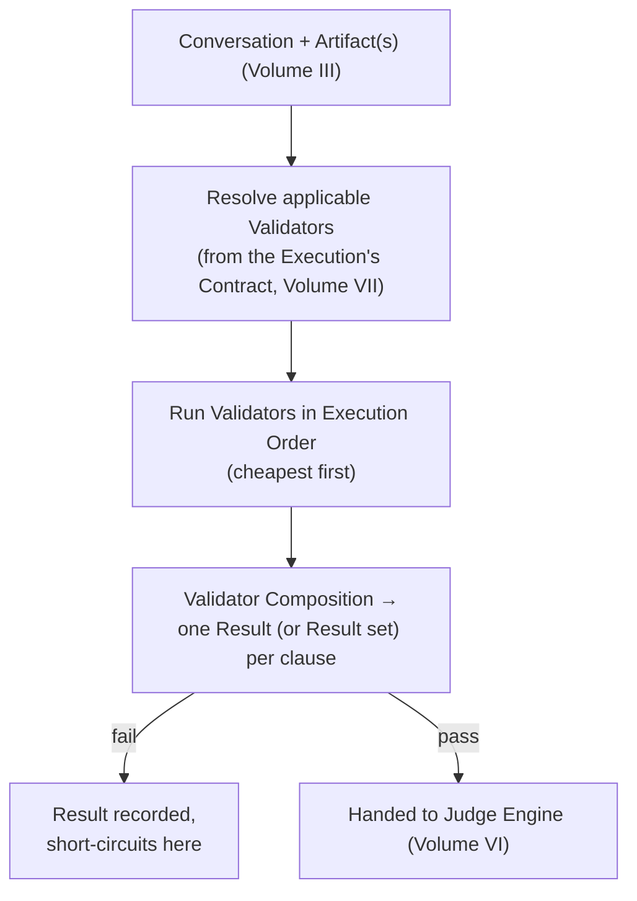

# Volume V — Validator Engine

**Status:** confirmed (v0.1).

*Question answered:* How responses are validated.

Chapter 4 named the Validator Engine as the component that executes Validators against
Evidence per a Contract, in the Execution Order that Validation-before-Evaluation
requires (Volume I). This Volume specifies the mechanics: what a Validator is
architecturally, in what order and how its checks combine into a single verdict, which
checks AQEF ships by default, how a Project extends that set safely, and the concrete
pipeline a completed Execution passes through on its way to becoming a Result — or a
short-circuit.

## Validator Architecture

A Validator, architecturally, is three things bound together: a deterministic check
function, a target — which part of the Conversation and/or Artifacts (Volume II) it
inspects — and a binding to one or more Quality Contract clauses (Volume VII) that
determine when it runs and what counts as passing. The check function itself MUST be a
pure function of its target evidence — the Glossary's constraint that a Validator "MUST
return the same Result for the same input" is the architectural requirement that makes
Validators cheap and trustworthy enough to run before anything probabilistic does
(Validation before Evaluation, Chapter 3). A Validator's Result carries no Confidence
value, and per "Everything has Confidence" (Chapter 3), MUST explicitly declare
Confidence inapplicable rather than simply omitting the field — an architectural
obligation on every Validator implementation, not an incidental detail left to
Reporting.

## Execution Order

Execution Order operates at two levels. At the level Chapter 3 already fixed: Validators
as a whole MUST run before Judges for a given Execution (Validation before Evaluation,
Chapter 3) — Chapter 4's Information Flow diagram already shows a failing
Validator Result short-circuiting before the Judge Engine is invoked at all. This Volume
adds the level below that: where a Contract binds more than one Validator to the same
Execution, those Validators SHOULD themselves run cheapest-first — a fast schema check
ahead of an expensive structural parse, for instance — so a check certain to fail
doesn't wait on one that was never going to matter. This is the same fail-fast reasoning
Validation-before-Evaluation already applies to the boundary between Validators and
Judges, nested one level down, inside the Validator Engine's own pipeline.

## Validator Composition

Where a Contract binds several Validators to the same clause or the same Execution,
Validator Composition is how their individual pass/fail outputs combine into one verdict
for that clause. Because Validators carry no Confidence to weight, composition here is
boolean, not the weighted combination Chapter 6's Aggregation Model performs on Results
across many Executions: a clause MAY require all of its bound Validators to pass (AND),
any one of them to pass (OR), or a specific Validator's failure to override the rest
regardless of what else passed — the "hard veto" Chapter 6 already described for Safety
is exactly a Validator Composition rule, not an Aggregation Model rule, since it operates
on the Validators of a single Execution, not on Results across many. Validator
Composition produces one Result (or one small set of Results) for the Execution it ran
against; the Aggregation Model is what happens afterward, across many such Results.

## Built-in Validators

AQEF ships a small set of Validators covering the checks the Glossary already names as
canonical Validator territory — schema conformance, forbidden content, structural
constraints, latency/cost thresholds:

- **Schema Validator** — checks a Response, or a tool-call argument set (Chapter 7),
  against an expected format or schema.
- **Tool-Call Validator** — checks that a tool invocation (Artifact, Volume II) selected
  a valid tool and supplied arguments conforming to that tool's own schema.
- **Structural Validator** — checks that a multi-step Conversation (AI
  Agent, Chapter 7) includes all required steps in valid order.
- **Forbidden-Content Validator** — checks for the presence of disallowed strings or
  patterns; this is the "hard, non-negotiable" half of Safety's dual enforcement
  (Chapter 2), the half a Validator, not a Judge, is responsible for.
- **Latency Validator** — checks a completed Execution's recorded duration against a
  threshold; distinct from a Timeout (Volume III), which aborts a run
  rather than assessing a finished one.
- **Cost Validator** — checks a completed Execution's token usage or resource cost
  against a threshold.

Every built-in Validator is still bound by Validator Architecture's constraints above:
deterministic, no Confidence value, Confidence explicitly declared inapplicable.

## Custom Validators

A Project MAY define Custom Validators for rules the built-in set doesn't cover — a
domain-specific format, a business rule expressible as a deterministic check. A Custom
Validator MUST satisfy the same constraints as a built-in one: the same input MUST
always produce the same Result, and it MUST NOT carry a Confidence value. This
constraint is not a formality — a check that internally relies on probabilistic
judgment (calling an AI model to decide pass/fail, for instance) does not satisfy it, no
matter how useful the check is or how confidently its author labels it a "Validator."
Such a check is structurally a Judge (Volume VI) and MUST be modeled as one; mislabeling
it risks exactly the failure Validation-before-Evaluation exists to prevent — a
probabilistic check running with the short-circuit privileges and unquestioned trust
Chapter 3 reserves for deterministic ones.

## Validator SDK

The Validator SDK is the interface a Custom Validator implementation MUST satisfy to be
runnable by the Validator Engine: given the target evidence it declares (a Conversation,
one or more Artifacts, or both — Volume II), it MUST return a Result carrying a
pass/fail verdict, an explicit Confidence-inapplicable declaration, and supporting
evidence sufficient for a Report (Volume XI) to explain the verdict without re-running
the check. The SDK does not itself grant any exemption from Validator Architecture's
constraints — it is the mechanical contract those constraints are expressed through, not
a separate set of rules.

## Validator Pipeline

For a given Execution, the Validator Pipeline is the concrete sequence this Volume has
now specified end to end:

This is the same short-circuit Chapter 4's Information Flow diagram and Chapter 5's
Validation stage already described; this Volume is what makes it concrete enough to
implement.

---

Every Validator this Volume describes — built-in or custom — is bound by the same three
constraints: deterministic, no Confidence value, and explicit about that absence.
Nothing about composition, ordering, or the SDK relaxes them; they exist precisely so a
Validator Result can be trusted at face value, which is what lets it run first,
short-circuit cheaply, and remain the fixed point the rest of the Decision Pipeline
(Chapter 6) can build weighted, probabilistic judgment on top of.
