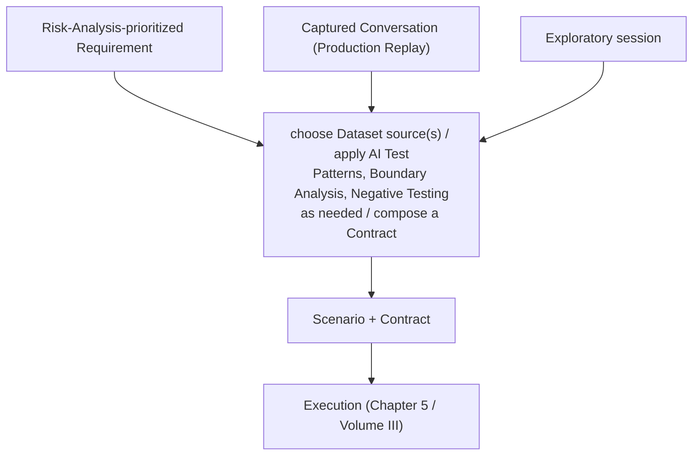

# Volume VIII — Test Design

*Question answered:* How AI tests are created.

Chapter 5 named Test Design as the lifecycle stage that turns prioritized Requirements
into Scenarios, Datasets, and the Quality Contracts attached to them — and named this
Volume as the place its process, patterns, and specific techniques are covered in depth.
Volume VII specified what a Contract looks like once authored; this Volume specifies how
a Scenario and its Contract actually get authored together, whether from a blank page,
from a captured Conversation, or from an exploratory session, and the techniques —
boundary analysis, negative testing, and a small catalog of AI-specific test patterns —
that make an authored Scenario worth more than the input it happens to cover.

| Section | Role |
|---|---|
| Test Design Process | The path from a prioritized Requirement, or a captured Conversation, to an authored Scenario + Contract pair |
| Risk-Based Testing | Acting on Risk Analysis's (Chapter 5) prioritization when authoring a Suite |
| AI Test Patterns | Named strategies for checking invariants rather than exact output |
| Boundary Analysis | Turning an Edge Cases Dataset (Volume IV) into Scenarios that probe named boundaries |
| Negative Testing | Deliberately probing what the system should refuse, decline, or reject |
| Exploratory AI Testing | Unscripted human-led probing — an instance of "Everything is a Test" (Chapter 3) |
| Test Maintainability | Keeping a growing Suite auditable, without drifting into Chapter 1's loosened-assertion failure mode |

## Test Design Process

Test Design has three distinct entry points, all converging on the same output: a
Scenario and the Quality Contract (Volume VII) attached to it.

- **Forward authoring**, starting from a Requirement Risk Analysis (Chapter 5) has
  already prioritized: choose a Dataset source or combination (Volume IV), decide which
  AI Test Patterns, Boundary Analysis, or Negative Testing apply, and compose or author
  a Contract for it.
- **Retroactive authoring from Production Replay** (Volume IV): a captured production
  Conversation becomes the Scenario, and a Contract gets applied to it after the fact —
  not an exception to Test Design, but an equally valid path through it (Chapter 5).
- **Retroactive authoring from an Exploratory session** (below): the same path as
  Production Replay, but the Conversation originates from a deliberate, unscripted
  human-led probe rather than real user traffic.

All three entry points MUST produce the same thing: a Scenario specific enough to be
realized by an Execution, and a Contract specific enough for an Oracle to check it
against — Test Design is complete once both exist, regardless of which entry point
produced them.

## Risk-Based Testing

Risk-Based Testing is how a Suite's composition acts on Risk Analysis's prioritization
(Chapter 5): more Scenarios, tighter Confidence thresholds, and Human
Reviewer requirements concentrated on the behaviors Risk Analysis identified as
high-stakes, fewer and looser ones where it did not. Risk Analysis decides what matters
most; Risk-Based Testing is this Volume's technique for acting on that decision when a
Suite actually gets authored — the two remain distinct, not two names for one activity.

## AI Test Patterns

An AI Test Pattern is a named, reusable strategy for writing an Expectation or
Constraint (Volume VII) that checks a relationship or invariant rather than an exact
expected output — the concrete, AI-specific descendant of the property-based testing
Chapter 1 already named as one of classical testing's techniques that stays inside the
deterministic-oracle assumption. Three recur across AQEF's other Volumes without having
been named as patterns yet:

- **Metamorphic Testing** — checking that a defined relationship holds between an
  original input and a Data-Mutated variant of it (Volume IV): paraphrasing a question
  MUST NOT change the meaning of the answer, for instance, even though the exact wording
  of both question and answer is free to vary.
- **Differential Testing** — running the same Scenario across two Environments (Volume
  II) — two model versions, two prompt versions — and checking that any difference in
  behavior is an intentional, reviewed change rather than an unnoticed one; the
  Scenario-level counterpart to Model Drift (Volume X).
- **Consistency Testing** — running the same Scenario repeatedly within one Environment
  and checking that outcomes stay within acceptable bounds of each other; the direct,
  per-Scenario operationalization of the Reliability dimension (Chapter 2).

*Terminology note:* "AI Test Patterns" names a testing-technique category — a way of
structuring a check. It is unrelated to "architectural patterns" (Chapter 7 — Single
LLM, RAG, AI Agent, and so on), which name what kind of system is under test, not how a
check against it is written.

## Boundary Analysis

Boundary Analysis turns an Edge Cases Dataset (Volume IV) into Scenarios that probe a
specific, named boundary — an empty input, a maximal-length input, a rare but valid
combination — one Scenario per boundary or a small Suite grouping related ones. Its
Contract typically sets a lower bar than a typical Scenario's: at a boundary, graceful,
well-formed handling (Functional Quality, Chapter 2) is often the primary Expectation,
with correctness of content a secondary concern layered on where it applies. This is the
technique Volume IV already forward-referenced: Volume IV specifies where Edge Cases
data comes from, this section specifies how it becomes a Scenario.

## Negative Testing

Negative Testing deliberately probes what the system should refuse, decline, or reject,
rather than what it should correctly do — malformed input it should handle gracefully
instead of crashing on, and disallowed requests it should decline instead of fulfilling.
Negative Testing draws on Adversarial Datasets (Volume IV) for its highest-stakes cases
and feeds directly into Volume IX's Safety, Jailbreak, and Prompt Injection test types,
but it is broader than Safety alone: a Constraint requiring graceful rejection of a
malformed tool argument (Chapter 7 — Tool Calling) is Negative Testing just as much as a
Constraint requiring refusal of a jailbreak attempt is, even though only the latter is
safety-critical.

## Seeded Controls

A Seeded Control is a Scenario carrying a deliberately planted, known defect whose
correct detection is known in advance. Its purpose is not to test the system. Its
purpose is to prove that an Oracle can still detect that class of defect in the current
run. This is fault seeding from classical testing, applied to the instrument rather than
the product: before a run's Results are trusted, the run demonstrates that the Oracle
producing them is not blind to the thing it is supposed to catch.

A Seeded Control differs from Negative Testing, above, in what a failure means. A
failed negative test is a defect in the system under test. A missed Seeded Control is
a defect in the Oracle, and it says nothing about the system except that this run cannot
be used to judge Results sharing the missed control's defect class. Because of this,
when a Seeded Control's Oracle fails to detect the seeded defect, every other Result the
Oracle produced in the same run that shares that defect class MUST take the disposition
`inconclusive` rather than `actionable` (Chapter 6); a miss does not by default reach
Results outside that class, since the miss never put them in question. A Project MAY
instead declare full-run invalidation for a given miss, but this is a deliberate
decision, not the default, and MUST record a reason (Volume XII) — a narrow miss should
not silently discard evidence it never disqualified. Seeded Control Results themselves
MUST be excluded from Aggregation.

**Coverage and order.** A Project SHOULD maintain at least one Seeded Control for each
Oracle whose Results feed a Quality Gate, and SHOULD run Seeded Controls before that
Oracle's other assessments in the same run, so that a miss is known before the work it
would invalidate is done. Seeded Controls apply to Validators as well as Judges: a
misconfigured pattern or an outdated schema blinds a Validator just as silently. They
are most valuable for Judges, though, because a blind Judge still returns confident,
plausible Results.

**Which Results share a defect class.** A Constraint or Expectation MAY declare the
defect classes it checks for (`defect_classes`, Appendix A §A.5). A miss affects the
clauses assessed by the same Oracle that declare the missed class. A clause that
declares no defect class is treated as covering every class its Oracle is tested on, and
is affected by any miss of that Oracle: an undeclared clause cannot be shown to be
outside the miss's reach.

**Failing fast.** Once an Oracle has missed a Seeded Control in a run, it SHOULD NOT be
invoked for the affected clauses for the rest of that run. Their Results take the
disposition `not_assessed` (Appendix C §C.7): no verdict, no assessment cost, and the
same blocking effect at a Quality Gate as `inconclusive`. Assessment by other Oracles,
and of other defect classes, continues, and the Evidence of the skipped clauses is kept
so that a requalified Oracle can assess it later. A Project MAY instead configure a miss
to halt the run (`on_seeded_control_miss: halt_run`, Appendix A §A.9); a halt records a
full-run invalidation with the configured policy as its reason.

**Generation and exposure.** A Seeded Control SHOULD be produced by a generator rather
than written by hand, and its individual instances SHOULD NOT be visible to anyone who
tunes the Oracle it tests. A generator SHOULD vary the surface form of what it plants,
so that an Oracle cannot learn to recognize the generator's habits instead of the
defect. A control known to have been seen by someone who tunes the Oracle it tests is
exposed and SHOULD NOT be used to gate that Oracle again; the more people a set of
controls has been exposed to, the sooner it needs replacing. Hand-authored controls
remain permitted; they are exposed by construction to whoever wrote them, which is why
authorship SHOULD stay separate from tuning, through Governance's Role/Permission
mechanism (Volume XII). An Oracle tuned to catch a defect class better in general is not
tuned around its controls: that is the improvement Seeded Controls exist to verify.

**Confirmed by construction.** A Seeded Control MUST record the defect it plants
(`planted_defect`, Appendix A §A.4): a defect nobody can state is not a known defect. A
control SHOULD also carry a confirmation, a Validator-bound check that the planted defect
is actually present in the Evidence the Oracle receives. A control runs through the
system under test like any other Scenario, and a defect planted in its input may not
survive into the response. Where confirmation fails, the control is `invalid` for that
run (Appendix C §C.3): it is neither caught nor missed, and nothing is inferred about the
Oracle from it.

**Difficulty prior.** A difficulty prior states how reliably independent reference
Oracles catch a class of defect, so that a miss can be read correctly: a miss on a class
that reference Oracles almost always catch says the Oracle under test went blind; a miss
on a class they rarely catch says less. The prior belongs to the defect class
(`defect_classes`, Appendix A §A.1), not to an individual control, because generated
controls are seldom reused and a per-control prior would never be established. A control
that is reused MAY carry its own prior, which takes precedence for that control. A prior
MUST be established from reference Oracles independent of the Oracle under test
(Independent Oracles, Chapter 3) or from Human Reviewers, and MUST NOT be updated from how
the Oracle under test performs against the controls; doing so would make the prior
depend on the instrument it exists to judge. A prior MUST state how many control
instances it was established on, and a class or control with no such history MUST be
represented as "not yet established", not as zero (Appendix A §A.4). A control that no
reference Oracle catches is more likely broken than hard, and SHOULD NOT gate an Oracle
until a Human Reviewer has confirmed it. Beyond that case, Human Reviewers are not
required: the prior is a reference for reading a miss, not a measurement of people.

**Requalification.** An Oracle that missed a Seeded Control is not used again for the
missed defect class until it is requalified. The cause is diagnosed (a changed model,
prompt, criteria, or configuration; or Judge Drift, Volume VI), the Oracle is corrected,
and the corrected Oracle catches fresh controls of that class. Never the control it
missed: the diagnosis exposed it. A requalified Oracle MAY then re-assess the stored
Evidence of the affected run, without invoking the system under test again. The new
Results are recorded against the corrected Oracle's configuration; the original
`inconclusive` or `not_assessed` Results remain in the record unchanged. This is not a
Retry (Volume III): the subject is not re-run, and the re-assessment is made by a
different, requalified Oracle, not by the same Oracle asked again until it agrees. A
Judge that missed a control inside a Multi Judge panel is handled by that panel's quorum
(Volume VI, Consensus).

## Exploratory AI Testing

Exploratory AI Testing is unscripted, human-led probing of the system to surface failure
modes no pre-authored Scenario covers — the same "exploratory sessions" Chapter 3
already named as a legitimate source of Conversations under Everything is a Test. An
exploratory session does not start from a Contract; a person interacts with the system
following their own judgment about where it might be weak, and only afterward, if
something worth keeping surfaces, does the session fold back into Test Design the same
way a Production Replay Conversation does (above) — a Contract applied retroactively,
the Conversation becoming a Scenario. Exploratory AI Testing's value is precisely that it
is not Risk-Based: it is how AQEF finds the behaviors nobody had enough information to
prioritize in advance.

## Test Maintainability

A growing body of Scenarios and Contracts degrades the same way a growing body of
classical test code does if nothing actively resists it — and Chapter 1 already named
the specific failure mode to guard against: a flaky or inconvenient Scenario "fixed" by
loosening its Contract until it stops checking anything meaningful, restoring a passing
Suite without restoring any actual check. Test Maintainability is this Volume's answer:
Reusable Contracts (Volume VII) reduce duplicated clauses that would otherwise need
updating independently in a dozen places; Dataset and Contract Versioning (Volume IV,
Volume VII) make it possible to tell a deliberate change from silent drift; and a
Contract loosened to stop a Suite from failing MUST be treated as a Requirements or Risk
Analysis decision (Chapter 5) — recorded and justified — not a Test Design convenience
applied quietly to make a red build green.

---

With Test Design specified, Part III's remaining two Volumes cover what a Scenario and
Contract get tested *for*: Volume IX (Test Types) names the categories of behavior AQEF
checks, and Volume X (Regression & Baselines) specifies how a Result gets compared
against history. Together with Volume VII, this Volume completes how AQEF answers
Chapter 5's question of what to test and how — every mechanism a Scenario or Contract
can draw on now has a specified source.
